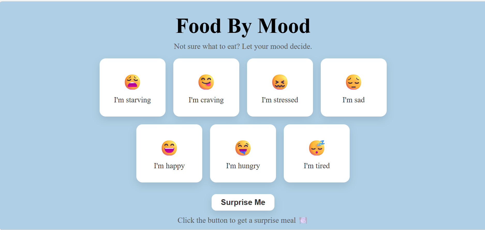

🔗 Live Demo: https://rachelsalomon.github.io/food-by-mood/

# Food By Mood

A simple web app that helps you decide what to eat based on your mood.

Choose how you feel (hungry, happy, stressed, tired, etc.) and get a meal suggestion — or use the "Surprise Me" button for a random pick.

## Tech Stack
- HTML
- CSS
- JavaScript

## Inspiration
Built during a challenging time, when even small decisions felt overwhelming — the idea was to create something simple, helpful, and a bit fun.
